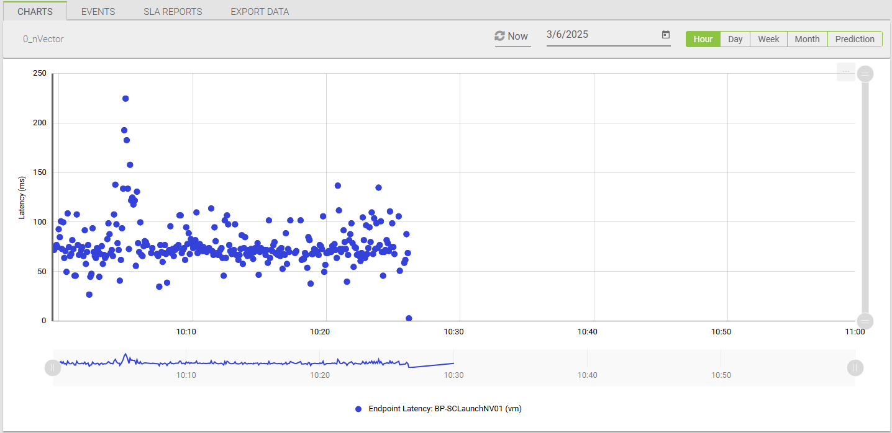

# nVector and Login Enterprise integration scripts

This repository contains a suite of integration scripts that wrap NVIDIA's **nvector-agent.exe** for use with the Login Enterprise platform. These scripts enable you to collect and upload round-trip latency data—measured via NVIDIA nVector’s watermarking mechanism—to the Login Enterprise API as **Platform Metrics**. The metrics can then be visualized in the Login Enterprise web interface or retrieved via our API.

> **Important:**  
> The nvector-agent.exe and its associated components are developed and distributed by **NVIDIA**. You must obtain this executable from NVIDIA and deploy it in your environment. For now, the nvector-agent.exe is not packaged with Login Enterprise and must be sourced directly from NVIDIA.

## Repository Overview

This repository provides four key scripts (plus a C# workload) to integrate nVector functionality with Login Enterprise:

1. **nVector_Client_Prepare.ps1** – *Client Role Wrapper*  
2. **nVector_Desktop_Prepare (C# workload)** – *Desktop/Target Role Wrapper*  
3. **nVector_Startup_Script.cmd** – *Invoker for Client Script*  
4. **get_nVectorMetrics.ps1** – *Raw Platform Metrics Data Retrieval*

Below you’ll find details on each script, including their purpose, main configurable parameters, and usage examples.

## 1. nVector_Client_Prepare.ps1

### Purpose

- Ensures the **Login Enterprise Launcher** process is running and starts it if it's not already active.
- Invokes `nvector-agent.exe` with the **client role** to measure round-trip latency.
- Terminates any running instances of `nvector-agent.exe` before restarting it with user-defined parameters.
- Monitors a CSV file for new latency results and uploads them to the Login Enterprise API as **Platform Metrics**.

### Key Variables & Parameters

- **`NvectorAgentExePath`**  
  Full path to the `nvector-agent.exe` on the Login Enterprise Launcher.

- **`CsvFilePath`**  
  Path to the CSV file where the nvector-agent writes latency metrics.

- **`NvectorScreenshotDir`**  
  Directory for screenshots (if required by nVector).

- **`NvectorLogFile`**  
  Log file path for the nvector-agent.

- **`ScriptLogFile`**  
  Path for logs produced by this PowerShell script.

- **`NvectorAgentCheckIntervalMs`**  
  How often (in milliseconds) the nvector-agent checks latency.

- **`PollingInterval`**  
  How frequently (in seconds) this script checks the CSV for new entries.

- **`MaxLatencyThreshold`**  
  Maximum allowed latency (in ms) before a reading is discarded as spurious.

- **`TimeOffset`**  
  Optional offset from UTC (e.g., `"0:00"`, `"-7:00"`, `"+2:00"`).

- **`ConfigurationAccessToken`**  
  Login Enterprise API token with **Configuration** access level.
  Refer to: [Public API: Adding a system access token](https://support.loginvsi.com/hc/en-us/articles/360009534760-Public-API#h_01HPKWM3D9D67KG9T7D40A0EYX)

- **`BaseUrl`**  
  Base URL of the Login Enterprise instance.

- **`ApiEndpoint`**  
  Endpoint for posting the latency metrics (default: `publicApi/v7-preview/platform-metrics`).

- **`EnvironmentId`**  
  Unique environment identifier in Login Enterprise (obtained from your appliance).
  Refer to: [Environments](https://support.loginvsi.com/hc/en-us/articles/7946104119324-Environments)

### Usage Example

1. **Edit the Script Variables:**  
   At the top of `nVector_Client_Prepare.ps1`, set paths, thresholds, time offsets, and API configuration details to match your environment.

2. **Invoke the Script:**  
   - Manually via PowerShell:  
     ```powershell
     .\nVector_Client_Prepare.ps1
     ```
   - Or automatically through `nVector_Startup_Script.cmd` or a scheduled task.

3. **Verification:**  
   - Check the PowerShell console or the `ScriptLogFile` to confirm that:
     - The **Login Enterprise Launcher** process is running.
     - The **nvector-agent.exe** was started in **client mode**.
     - New lines in the CSV are being uploaded to the **Login Enterprise API**.

## 2. nVector_Desktop_Prepare (C# Workload)

### Purpose

- Runs on the **Target/Desktop** machine in Login Enterprise, often configured as a **workload**.
- Ensures the **nvector-agent.exe** is available by downloading it from the Login Enterprise virtual appliance if necessary.
- Starts `nvector-agent.exe` with the **desktop role** (`-r desktop`) to generate a watermark for latency measurement.
- The **client role** `nvector-agent.exe` running on the Login Enterprise Launcher detects these watermarks to calculate round-trip latency.

### Key Variables & Parameters

- **`downloadUrl`**  
  URL for `nvector-agent.exe` on your Login Enterprise appliance (e.g., `https://myDomain.LoginEnterprise.com/contentDelivery/content/nvidia/nvector-agent.exe`).

- **`tempDir`**  
  Location (commonly `%TEMP%`) where the agent will be temporarily stored.

- **`logFilePath`**  
  Path for the desktop agent’s log file.

### Usage Example

1. **Upload the Workload:**  
   - Use the **Login Enterprise web interface** to upload `nVector_Desktop_Prepare.cs` as a **custom workload**.
   - Configure the workload settings (e.g., set to **Run Once** if applicable).

2. **Adjust Variables as Needed:**  
   - Update `downloadUrl` to match the HTTPS path where `nvector-agent.exe` is hosted on your appliance.
   - Change `logFilePath` if needed to specify a different location for the log output.

3. **Run the Workload:**  
   - When executed, the workload downloads and runs `nvector-agent.exe` in **desktop mode** (`-r desktop`).
   - The **client role** `nvector-agent.exe` on the Login Enterprise Launcher will detect the watermark changes and use them to compute round-trip latency.

## 3. nVector_Startup_Script.cmd

### Purpose

- A simple **Windows CMD script** that invokes `nVector_Client_Prepare.ps1` on the **Login Enterprise Launcher**.
- Ensures that the **client script** runs automatically at user login without requiring manual execution.
- Can be placed in the **Windows Startup folder** or configured as a **scheduled task**.

### Key Configuration

- **File Path to PowerShell Script:**  
  Update the CMD file with the correct path to `nVector_Client_Prepare.ps1` to match its location on the **Login Enterprise Launcher**.

### Usage Example

To automatically start `nVector_Client_Prepare.ps1` at user login, create the following **CMD script**:

```@echo off
powershell.exe -ExecutionPolicy Bypass -File "C:\Path\To\nVector_Client_Prepare.ps1"
```

#### **Save and Place:**
- Save the CMD file and place it in the **Windows Startup folder**:  
```
C:\ProgramData\Microsoft\Windows\Start Menu\Programs\Startup
```

#### **Automatic Invocation:**
- When a user logs in, the CMD file runs and starts the **client integration** automatically.
- Alternatively, configure it as a **Windows Task Scheduler job** for more control over execution timing.

## 4. get_nVectorMetrics.ps1

### Purpose

- Retrieves raw **Platform Metrics data** (including **nVector latency**) from the **Login Enterprise API**.
- Queries the **v7-preview/platform-metrics** API endpoint.
- Allows users to **export latency data** for further analysis in **CSV or JSON format**.
- Can be used to **validate latency measurements** retrieved from the **nVector client script**.

### Key Parameters

- **`StartTime`, `EndTime` (Mandatory)**  
  - Defines the time range for retrieving metrics.  
  - Must be in **ISO 8601 Zulu format** (e.g., `"2025-02-07T00:00:00.000Z"`).  

- **`EnvironmentId` (Mandatory)**  
  - Unique identifier for the **Login Enterprise environment**.  
  - Filters metrics to only include data from the specified environment.  

- **`ApiAccessToken` (Optional)**  
  - Overrides the default **Login Enterprise API token**.  

- **`BaseUrl` (Optional)**  
  - Overrides the default **Login Enterprise API Base URL**.  

- **`OutputCsvFilePath`, `OutputJsonFilePath` (Optional)**  
  - Defines where the retrieved metrics will be saved.  
  - If omitted, defaults to:
    - CSV: `C:\temp\get_nVectorMetrics.csv`
    - JSON: `C:\temp\get_nVectorMetrics.json`

- **`LogFilePath` (Optional)**  
  - Specifies a log file to store script execution details.  
  - Default: `C:\temp\get_nVectorMetrics_Log.txt`

### Usage Example

To retrieve **nVector latency metrics** from the **Login Enterprise API**, run the following command:

```
.\get_nVectorMetrics.ps1 -StartTime "2025-02-07T00:00:00.000Z" -EndTime "2025-02-07T23:59:59.999Z" -EnvironmentId "abcdef1234" -ApiAccessToken "MY_TOKEN" -BaseUrl "https://mydomain.LoginEnterprise.com" -OutputCsvFilePath "C:\temp\nVector.csv" -OutputJsonFilePath "C:\temp\nVector.json" -LogFilePath "C:\temp\MetricsLog.txt"
```

#### Expected Behavior:

- Retrieves **Platform Metrics data** for the specified time range.  
- Saves results as:

  - **JSON file** (`OutputJsonFilePath`)
  - **CSV file** (`OutputCsvFilePath`)  
- Logs execution details in **LogFilePath**.

## Setup & Deployment Steps

### 1. Upload `nvector-agent.exe` to the Login Enterprise Appliance

- Place the executable on the **Login Enterprise virtual appliance** at:  
```
/loginvsi/content/nvidia/nvector-agent.exe
```

- Use **SFTP tools like WinSCP** if necessary to transfer the file.

### 2. Configure Scripts

- In **nVector_Client_Prepare.ps1**, set paths for the **CSV file, logs, time offsets, and API configuration**.
- In **nVector_Desktop_Prepare**, update the `downloadUrl` to point to where `nvector-agent.exe` is hosted.
- In **get_nVectorMetrics.ps1**, modify default **output file paths and API parameters** if necessary.

### 3. Automation

- Place `nVector_Startup_Script.cmd` in the **Windows Startup folder** to ensure the client script runs on user login.
- Upload and configure the **desktop workload** in the **Login Enterprise web interface**.  
Refer to:
- [Application Upload Documentation](https://support.loginvsi.com/hc/en-us/articles/360001341979-Applications)
- [Login Enterprise Script Editor](https://support.loginvsi.com/hc/en-us/articles/360014619659-Login-Enterprise-Script-Editor)

### 4. Testing

- Verify that the **Desktop workload successfully downloads and runs `nvector-agent.exe`** in desktop mode.  
- Confirm that the **client script processes CSV data and uploads metrics**.  
- Use `get_nVectorMetrics.ps1` to **retrieve and validate the platform metrics data**.

## Examples of Latency Results

### Hourly View

#### Screenshot
The following example graph visualizes nVector latency measurements over an hourly timeframe in the Login Enterprise web interface.



---

#### **Explanation of Graph Elements:**

- **Y-Axis (Latency in ms)** → Each **datapoint** represents a **latency measurement in milliseconds**.  
- **X-Axis (Time in Hourly Span)** → Represents the **time range** for **nVector latency measurements**.  
- **"Latency (ms)"** → This corresponds with the **`unit` key** in the API datapoint.  
- **"Endpoint Latency"** → This corresponds with the **`displayName` key** in the API datapoint.  
- **Hostname (e.g., BP-SCLaunchNV01)** → This corresponds with the **`instance` key** in the API datapoint.  
- **"vm" (Component Type)** → This corresponds with the **`componentType` key** in the API datapoint.  

These labels align **directly with the API response structure** and are displayed in the **Login Enterprise web interface graphs**.

## Additional Information

### Best Practices

- Use **clear and concise** variable configurations.
- Follow **robust error-handling and logging practices**.
- Ensure that both the **desktop (Target) and client (Launcher) machines** meet **NVIDIA’s nVector system requirements**.
- Regularly **verify CSV file processing** and API uploads to confirm data integrity.

### Notes

- The **integration scripts act as wrappers** around NVIDIA’s `nvector-agent.exe`, orchestrating its execution in both **client and desktop modes**.
- Latency results can **vary** based on **system load and graphical intensity** on the Target machine.
- The `get_nVectorMetrics.ps1` script **bypasses certificate validation**—only use it in **trusted environments**.

### Documentation Links

- [Login Enterprise Application Upload](https://support.loginvsi.com/hc/en-us/articles/360001341979-Applications)
- [Login Enterprise Script Editor](https://support.loginvsi.com/hc/en-us/articles/360014619659-Login-Enterprise-Script-Editor)
- [Public API: Adding a system access token](https://support.loginvsi.com/hc/en-us/articles/360009534760-Public-API#h_01HPKWM3D9D67KG9T7D40A0EYX)
- [Environments](https://support.loginvsi.com/hc/en-us/articles/7946104119324-Environments)

## Change Log

### v1.0

- Initial release of the **nVector Metrics Uploader Integration scripts**.  
- Includes:
  - **Client Prepare Script (`nVector_Client_Prepare.ps1`)** for invoking `nvector-agent.exe` in client mode.
  - **Desktop Prepare Workload (`nVector_Desktop_Prepare.cs`)** for running `nvector-agent.exe` in desktop mode.
  - **Startup Script (`nVector_Startup_Script.cmd`)** for automating client script execution.
  - **Metrics Retrieval Script (`get_nVectorMetrics.ps1`)** for querying and exporting latency data from the Login Enterprise API.
- Documentation includes **setup, automation, and API integration details**.

© NVIDIA nVector and Login VSI. All rights reserved.  
For support, contact [support@loginvsi.com](mailto:support@loginvsi.com).
